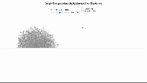

# Graph Motif Compression via Wasserstein Clustering

This project explores **graph simplification** through **motif clustering**, using Wasserstein distance to group structurally similar subgraphs (motifs). It enables users to interactively visualize large networks by replacing repeated substructures with supernodes—without compromising structural integrity.

---

## Project Intent

Large network graphs often contain **repeated motifs** (e.g., triangles, stars). Visualizing them as-is leads to “hairball” graphs that are hard to interpret.

### This project aims to:

* Identify recurring motifs in a graph.
* Use **Wasserstein distance** to measure structural similarity.
* Agglomeratively cluster motifs by threshold-based compression.
* Interactively visualize these changes using **D3.js**.

---

## Tech Stack

| Component       | Stack Used                              |
| --------------- | --------------------------------------- |
| Backend         | Python, Flask                           |
| Visualization   | D3.js                                   |
| Data Processing | NetworkX, pandas, scikit-learn          |
| Math Core       | SciPy (Wasserstein distance)            |
| Frontend UI     | HTML, CSS (with Inter font), JavaScript |
| Plotting (Dev)  | matplotlib                              |

---

## How to Use

### 1. Clone the Repo

```bash
git clone https://github.com/yourusername/graph-motif-compression.git
cd graph-motif-compression
```

### 2. Install Dependencies

```bash
pip install -r requirements.txt
```

### 3. Run the Server

```bash
python server.py
```

### 4. Open the Frontend

Just open `index.html` in your browser (Google Chrome recommended).

---

## Features

### Interactive Controls

* Set compression threshold with a slider.
* Auto-play button to gradually increase compression.
* Summary panel showing live compression stats.

### Motif Visualization

* Cluster boxes show all **unique compressed motif shapes**.
* Each box displays **how many times** that motif occurred.
* Hovering on a box highlights corresponding nodes in the main graph.

### On-demand Expansion

* Clicking a compressed node expands its subgraph.

### Real-Time Compression Metrics

* Number of original vs compressed nodes.
* Compression ratio (%).

---

## Demo




*Video: Watch a complex Facebook network get compressed into interpretable structures using similarity threshold tuning.*

---

## How It Works

1. **Motif Extraction**: Local neighborhoods are extracted around each node.
2. **Similarity Calculation**: Edge weight distributions of motifs are compared using **Wasserstein distance**.
3. **Agglomerative Clustering**: Motifs are merged based on similarity threshold.
4. **Supernode Formation**: Similar motifs are replaced with a compressed node.
5. **D3 Visualization**: Main graph + motif gallery + summary panel are dynamically updated.

---

## Example Use Cases

* **Cybersecurity**: Detect recurring attack structures (fan-outs, lateral movement).
* **Social Networks**: Spot repeated interaction patterns across user groups.
* **Biology**: Visualize repeated biochemical or protein-interaction motifs.

---

## Credits

Research conducted at the **University of Utah**, Scientific Computing and Imaging (SCI) Institute, under the guidance of **Dr. Paul Rosen**.
